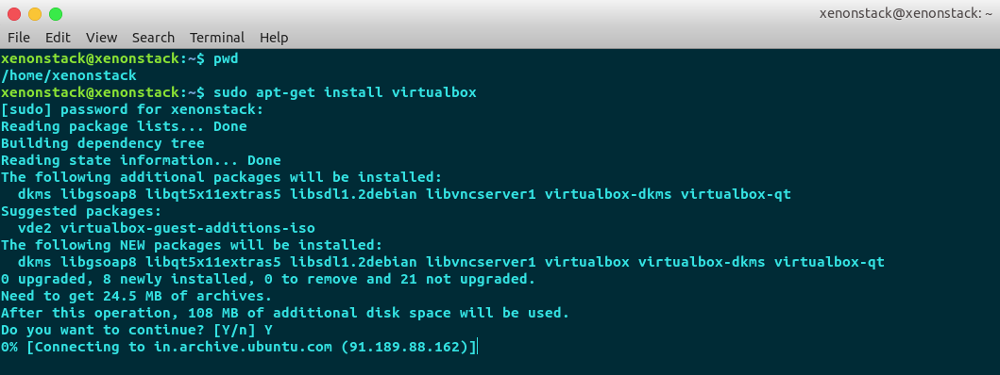
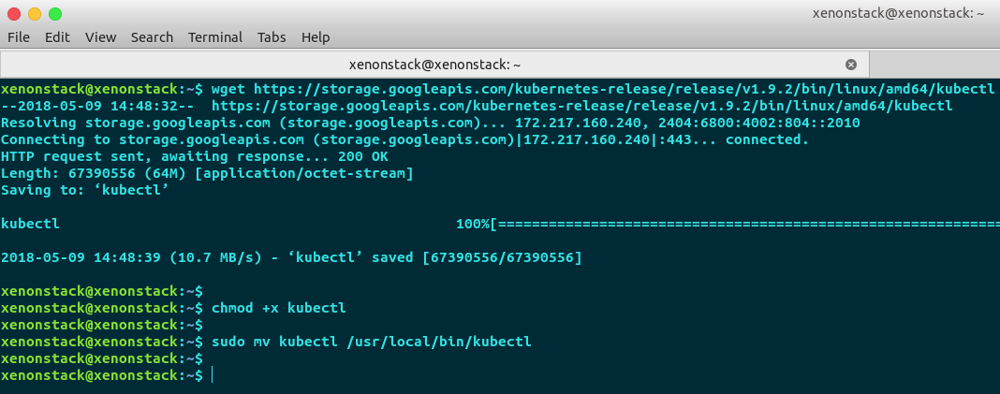
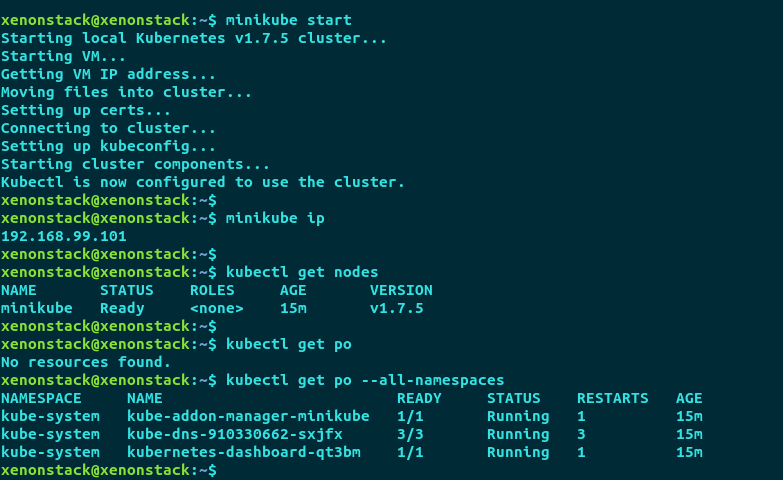
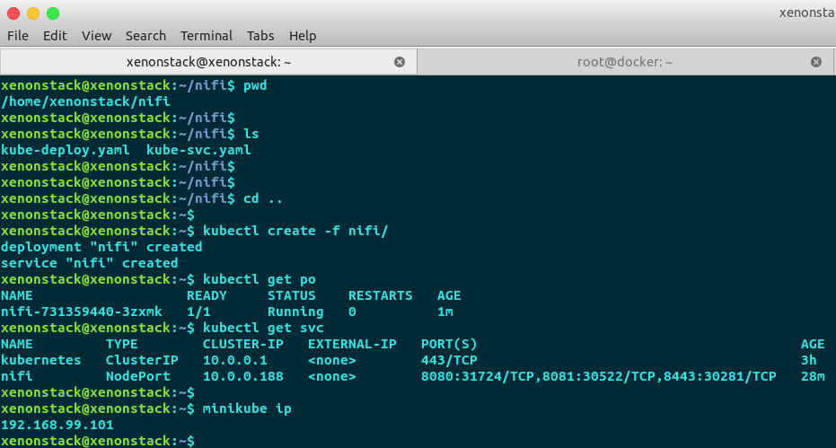
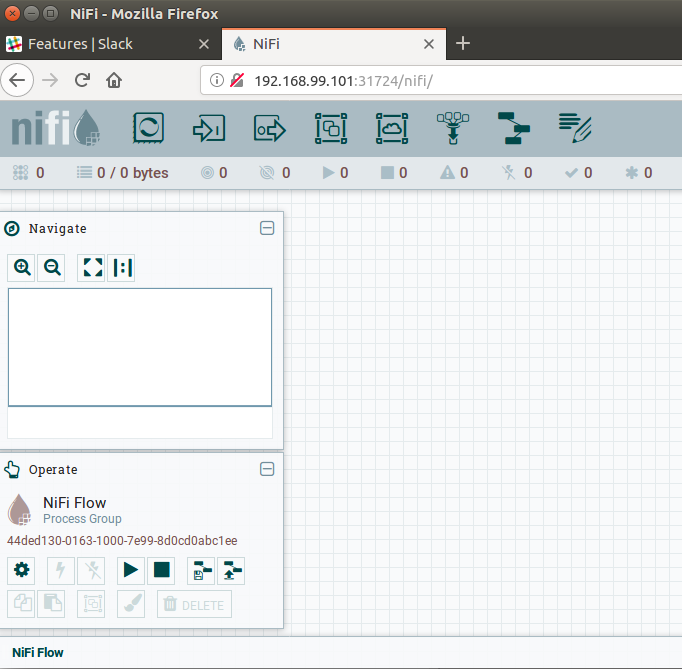
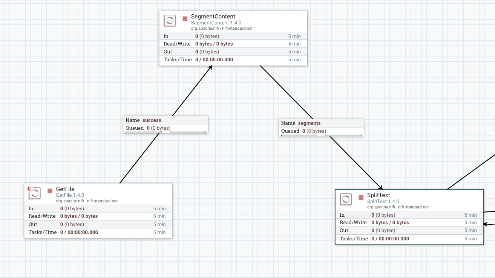
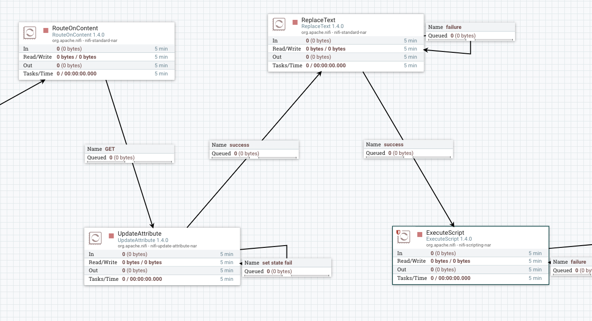

# Logs Monitoring using Apache NiFi

## NiFI Deployment on Kubernetes (MiniKube)

* Install Minikube on Ubuntu 16.04
* Steps to install Minikube :
* 2 conditions need to be meet before we can install MiniKube on our system
 * VT-x or AMD-v virtualization must be enabled in your computer’s BIOS. ( If it’s not enabled , head over to your BIOS settings & Enable it )

 * A Hypervisor is installed on system (For Linux , we can use VirtualBox or KVM
) - For this demo, VirtualBox is used

* A local machine is used to install & demonstrate minikube instead of a Cloud environment.
 * Note  : These steps will work in any Ubuntu box on any of your favourite cloud


* Installing VirtualBox :

 * `sudo apt-get install virtualbox`



* Installing kubectl :

 * `wget https://storage.googleapis.com/kubernetes-release/release/v1.9.2/bin/linux/amd64/kubectl`

 * chmod +x kubectl

 * sudo mv kubectl /usr/local/bin/kubectl



* Installing MiniKube :

 * `wget -O minikube https://storage.googleapis.com/minikube/releases/v0.22.0/minikube-linux-amd64 && chmod +x minikube && sudo mv minikube /usr/local/bin/`


* Test MiniKube :

  * `minikube start`


  

* Now , Let us deploy Apache NiFi on our MiniKube setup
* For this , we have to create 2 files namely :
  * kube-deploy.yaml  
  * kube-svc.yaml  
* These 2 files will be added in your Git repo, so you can pull from there.
* We are using hostpath for persisting the storage in kube deployment file.
* Make a new directory named nifi & add these 2 files in the directory
* Run following commands in your terminal



* For first time , you pod might take some time to come in running state , as it will pull image from docker hub.

* Once it comes in running state , get ip of your minikube machine using :
 * `minikube ip`


* Copy NodePort of 8080 service ( 31724 in our case )

* Open browser & open IP:Port/nifi
 * http://192.168.99.101:31724/nifi in our case (as you can see from above screenshot)
 * You will see something like below



* Now , you can interact with NiFi , & all your data will be persisted in MiniKube VM

* That's it. Let's start with dataflow:)

## NiFi Flow
File nifi-flow-template.xml can be used to import the flow to Apache NiFi. This files contains the process group which contains different processors to do the transformations. All processor's roles is defined in next section.
#### Data Source
We have used the data source which contains HTTP requests to the NASA Kennedy Space Center WWW server in Florida.

http://ita.ee.lbl.gov/html/contrib/NASA-HTTP.html


The logs are an ASCII file with one line per request, with the following columns:
- **Host** making the request . A hostname when possible, otherwise the Internet address if the name could not be looked up.
- **Timestamp** in the format "DAY MON DD HH:MM:SS YYYY", where DAY is the day of the week, MON is the name of the month, DD is the day of the month, HH:MM:SS is the time of day using a 24-hour clock, and YYYY is the year. The timezone is -0400.
- **request given in quotes.**
- **HTTP reply code.**
- **bytes in the reply.**

We have downloaded the logs from 00:00:00 July 1, 1995 through 23:59:59 July 31, 1995. And using that as the data source in Apache NiFi.

#### NiFi DataFlow

- **GetFile Processor:** We have used GetFile processor to fetch the download data from local disk. This file contains around 1.89 million logs.

- **SegmentContent:** After ingesting the input file our next goal is to split each row and find whether the HTTP request id GET request or not. As the input file is too big, so to prevent the java heap space issue we will break that file into small chunks by using SegmentContent. We can set our own segment size to break the big file into multiple small files.


- **SplitText:** Now we have small files which we can use for splitting the lines. We will use SplitText to split each row of the log file. So, at this point we have each log in terms of single file or single row. Now we will proceed to find whether the request is GET or not.
RouteOnContent: RouteOnContent is the nifi processor in which we can route our flowfile content if the content matches to the given regular expression. So in match requirement we will choose ‘content must contain match’ and will add a new property to match our GET requests. This process will send only the logs for GET requests to the next processor and discard all others



- **UpdateAttribute:** Now we will add one more attribute that will contain the flowfile count. So for that we will use UpdateAttribute processor and and increment the count for each flowfile and that we can use that attribute to append to the content.

- **ReplaceText:** At this point we have line number as an attribute. We will append that attribute to the flow file content. Now the transformed log data will have one value GET request number along with, host, timestamp, request, HTTP reply code, bytes in reply.

- **ExecuteScript:** Now it’s time to store the data into the local file system and also we need to append the data into the existing file. But NiFi processor PUTFile doesn’t support the appending to an existing file. So, I’ve choose execute script to do the same. In this, I’ve made groovy script to append the data to the existing file. 

 
 
Here is the groovy script:


```import org.apache.commons.io.IOUtils
import java.nio.charset.StandardCharsets
import org.apache.nifi.flowfile.attributes.CoreAttributes
 
flowFile = session.get()
if(!flowFile)return
def text = ''
session.read(flowFile, {inputStream ->
//get the content of the file 
 text = IOUtils.toString(inputStream, StandardCharsets.UTF_8)
 
} as InputStreamCallback)
def f = new File("/Users/naveen/Downloads/text.txt")
//appending data to the file
f.append(text)
flowFile = session.putAttribute(flowFile, CoreAttributes.MIME_TYPE.key(), "application/json")
session.transfer(flowFile, REL_SUCCESS)
```

